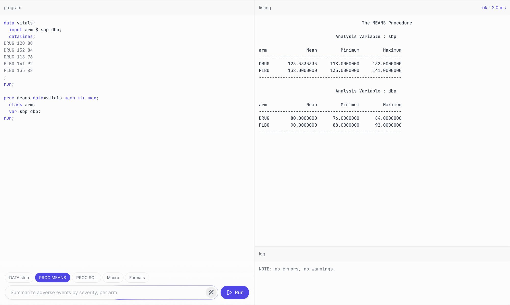

<div align="center">

# OpenSAS

**An open-source interpreter for the SAS® 9.4 language.**<br>
A standalone binary that runs SAS everywhere for you or your coding agents.


[](https://github.com/kirha-ai/opensas/actions/workflows/ci.yml)
[](https://github.com/kirha-ai/opensas/releases)
[](https://ziglang.org)
[](LICENSE)

[**Try it in the browser**](https://kirha.com/playground/opensas) · [**Download**](https://github.com/kirha-ai/opensas/releases) · [**The build story**](https://kirha.com/research/opensas)

<br>

<a href="https://kirha.com/playground/opensas"></a>

</div>

<br>

 The OpenSAS community, although currently focused on the mandatory subset of SAS used in clinical trials, is always keeping an eye on expanding its feature support to achieve full compatibility with other industry use cases.

It reads and writes `.sas7bdat` and `.xpt` files and runs the DATA
step, the macro language, PROC SQL and the reporting and data-management PROCs.
Built on production clinical-trial (CDISC) pipelines.

- **Audit compliant.** Zero-dependency static binary that runs ubiquitously across Linux, macOS, Windows, WebAssembly.
- **Checked against SAS® 9.4.** OpenSAS output datasets have been diffed against official runtime output. For what it supports, the bytes match.
- **Fails loud.** Unsupported language feature stops with a dedicated error code (2) and line number so you or your agent can differentiate from programming error (1). Zero false positives.

## Quick start

Grab a binary from the [releases page](https://github.com/kirha-ai/opensas/releases)
(Linux arm64 and x86_64, Windows x86_64, macOS arm64), or build it with Zig 0.16.0:

```sh
git clone https://github.com/kirha-ai/opensas && cd OpenSAS
zig build -Doptimize=ReleaseFast        # binary at zig-out/bin/sas
```

Write a program:

```sas
data vitals;
  input usubjid $ visit $ sysbp diabp;
  map = round(diabp + (sysbp - diabp) / 3, 0.1);
  datalines;
S001 BASELINE 128 82
S001 WEEK4    121 79
S002 BASELINE 142 91
S002 WEEK4    135 88
;
run;

proc sort data=vitals; by usubjid descending visit; run;

proc print data=vitals noobs;
  where map > 100;
run;
```

Run it:

```
$ sas vitals.sas
usubjid   visit      sysbp   diabp     map

S002      WEEK4        135      88   103.7
S002      BASELINE     142      91     108
```

`sas --sasautos ./macros program.sas` adds an autocall macro library. A
`libname` points to a directory; members resolve as `.sas7bdat`, `.xpt` or
`.csv`, and datasets the program writes land there in the same formats.
[`tests/programs/dm`](tests/programs/dm) is a complete example: a raw
demographics dataset mapped to the SDTM DM domain, with the expected output.

### Exit codes

| Code | Meaning |
|:---:|---|
| `0` | Clean run |
| `1` | Error in your program: syntax, missing dataset, bad data |
| `2` | Feature not supported, or an OpenSAS bug. [Open an issue](https://github.com/kirha-ai/opensas/issues/new) with the program. |

A script or an agent can route on the code without parsing the log: 1 is your
program, 2 is our gap.

## In the browser

The interpreter compiles to `wasm32-wasi` and runs in the page. Programs and
data never leave your machine. The hosted version is at
[kirha.com/playground/opensas](https://kirha.com/playground/opensas); to serve
it yourself:

```sh
make wasm                        # builds web/sas.wasm
python3 -m http.server -d web    # open http://localhost:8000
```

## How it is verified

Three suites run in CI on every push and before every release.

- **Unit tests.** 909 `test` blocks next to the code they cover.
- **Conformance corpus.** 1,894 one-feature programs in [`tests/corpus/`](tests/corpus). Each program runs and its listing is diffed against the expected output.
- **End-to-end programs.** Whole programs in [`tests/programs/`](tests/programs), datasets in and datasets out. Every output column and value is diffed against the golden dataset.

The `.sas7bdat` and `.xpt` readers and writers are round-tripped against files
written by SAS® 9.4. Fixtures use invented data or published samples such as the
CDISC pilot study.

## What's supported

**DATA step.** Assignment, conditionals and `select`, all forms of `do` loops,
`where`, arrays, `retain`, `lag` and `dif`, multiple `output` targets,
`drop`/`keep`/`rename`, `length`/`label`/`attrib`, hash objects, and formatted,
column and list `input`.

**BY-group processing.** `first.` and `last.` flags, `merge` with `in=`, `set`
concatenation, and the dataset options (`keep=`, `drop=`, `rename=`, `where=`,
`firstobs=`, `obs=`).

**Macro language.** Nested macros with keyword and positional parameters,
`%let`/`%global`/`%local`, `%if` and `%do`, `%eval` and `%sysevalf`, `%sysfunc`,
the quoting functions, `&&` indirection, `%include`, autocall libraries, and
`CALL SYMPUT`/`SYMPUTX` resolved at step boundaries.

**Functions and formats.** 468 built-in functions with missing-value semantics
([full list](docs/sas-functions.md)). Numeric, character and date/time formats
and informats, `PERCENT`, and user formats through `PROC FORMAT`.

**Procedures.** PRINT, SORT, MEANS and SUMMARY, FREQ, UNIVARIATE, TRANSPOSE,
REPORT, TABULATE, SQL, DATASETS, COMPARE, CONTENTS, FORMAT, IMPORT and EXPORT
(CSV, delimited, XLSX), DELETE.

**Dataset I/O.** Read and write `.sas7bdat` and XPORT `.xpt`, plus CSV-backed
libraries.

The grammar is catalogued production by production in
[`docs/sas9.4.ebnf`](docs/sas9.4.ebnf), with an `(* opensas *)` mark on each
implemented one.

**Not there yet.** Modeling and survival procedures (GLM, MIXED, LOGISTIC,
LIFETEST, ...) and graphics procedures (GPLOT, SGPLOT, ...). They exit with
code `2`. ODS statements for destinations other than the listing are parsed and
ignored.

## Development

```sh
zig build                    # debug binary
zig build test               # unit tests
zig build corpus             # conformance corpus
zig build programs           # end-to-end programs
make arm amd windows macos   # cross-compile release binaries into dist/
```

```
src/             lexer, parser, DATA step, macro processor, PROCs, dataset I/O
tests/corpus/    one-feature .sas programs with expected listings
tests/programs/  end-to-end programs with input and golden datasets
docs/            grammar and function trackers, design decisions
web/             browser demo
```

## Contributing

The most useful contribution is a program that runs in SAS® 9.4 but not here.
Open an issue with the smallest `.sas` that reproduces it, the expected output,
and what OpenSAS produces along with its exit code.

Pull requests are welcome. Every non-trivial change ships with a test: a `test`
block next to the code, or a fixture in `tests/corpus/` with its expected output.
House rules live in [`CLAUDE.md`](CLAUDE.md), settled design decisions in
[`docs/decisions.md`](docs/decisions.md).

## About

OpenSAS is a research project by [KIRHA](https://kirha.com). Coding agents wrote
the implementation from the public SAS® 9.4 documentation. Correctness is judged
against reference output through the suites above, not against the agents' own
assessment. How the team was organised, what worked and what did not is written
up at [kirha.com/research/opensas](https://kirha.com/research/opensas).

## License

[Apache 2.0](LICENSE).

SAS® is a registered trademark of SAS Institute Inc. This project is not
affiliated with, endorsed by, or sponsored by SAS Institute Inc.
